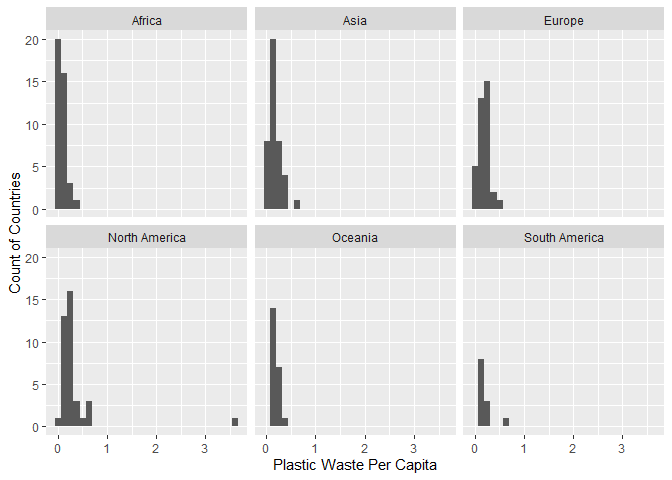
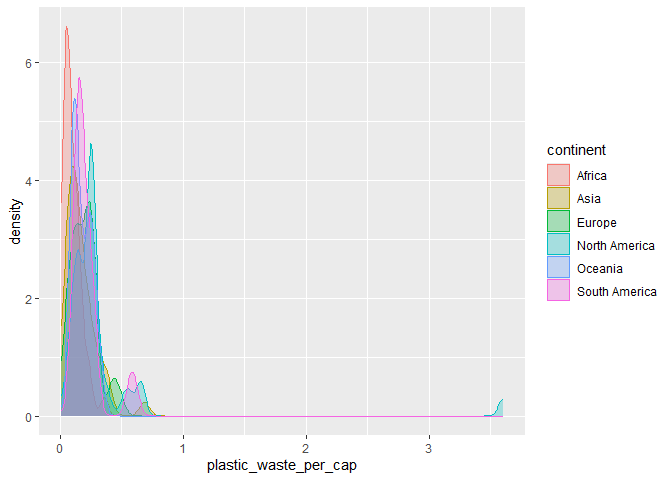

Lab 02 - Plastic waste
================
Insert your name here
Insert date here

## Load packages and data

``` r
library(tidyverse) 
```

``` r
plastic_waste <- read.csv("data/plastic-waste.csv")
```

## Exercises

### Exercise 1

The country of the highest plastic waste per capita is located in North
America. Overall, it seems like North America has more countries with
comparitively higher plastic waste per capita than other continents.

``` r
ggplot(
  data = plastic_waste,
  aes(x = plastic_waste_per_cap)
) +
  geom_histogram() +
  facet_wrap(~ continent) +
  labs(x = "Plastic Waste Per Capita", y = "Count of Countries")
```

    ## `stat_bin()` using `bins = 30`. Pick better value `binwidth`.

    ## Warning: Removed 51 rows containing non-finite outside the scale range
    ## (`stat_bin()`).

<!-- -->

### Exercise 2

We defined the color and fill of the curves by mapping aesthetics of the
plot but defined the alpha level as a characteristic of the plotting
geom because we want to have different colors and fills for different
continents, while the alpha level to be the same across all continents.
Mapping aesthetics allows us to assign unique features to each category,
while geom allows us to assign the same feature to all cagtegories.

``` r
ggplot(
  data = plastic_waste,
  mapping = aes(
    x = plastic_waste_per_cap,
    color = continent,
    fill = continent
  )
) +
  geom_density(alpha = 0.3)
```

    ## Warning: Removed 51 rows containing non-finite outside the scale range
    ## (`stat_density()`).

<!-- -->

### Exercise 3

Remove this text, and add your answer for Exercise 3 here.

``` r
# insert code here
```

### Exercise 4

Remove this text, and add your answer for Exercise 4 here.

``` r
# insert code here
```

``` r
# insert code here
```

``` r
# insert code here
```

``` r
# insert code here
```

### Exercise 5

Remove this text, and add your answer for Exercise 5 here.

``` r
# insert code here
```
