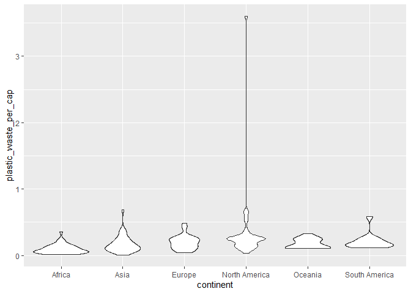
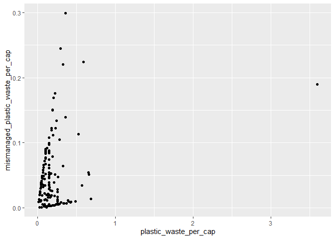
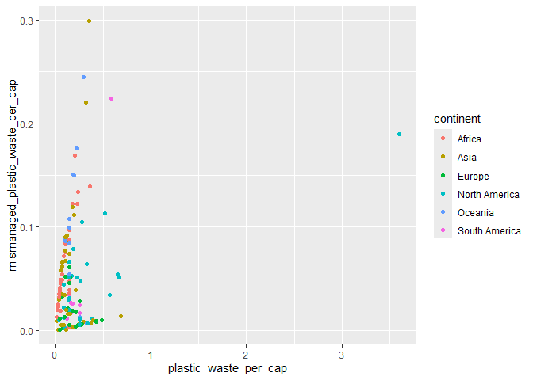

Lab 02 - Plastic waste
================
Yiwei Tang
1/22/2026

## Load packages and data

``` r
library(tidyverse) 
```

``` r
plastic_waste <- read.csv("data/plastic-waste.csv")
```

## Exercises

### Exercise 1

The country of the highest plastic waste per capita is located in North
America. Overall, it seems like North America has more countries with
comparitively higher plastic waste per capita than other continents.

``` r
ggplot(
  data = plastic_waste,
  aes(x = plastic_waste_per_cap)
) +
  geom_histogram() +
  facet_wrap(~ continent) +
  labs(x = "Plastic Waste Per Capita", y = "Count of Countries")
```

    ## `stat_bin()` using `bins = 30`. Pick better value `binwidth`.

    ## Warning: Removed 51 rows containing non-finite outside the scale range
    ## (`stat_bin()`).

<!-- -->

### Exercise 2

We defined the color and fill of the curves by mapping aesthetics of the
plot but defined the alpha level as a characteristic of the plotting
geom because we want to have different colors and fills for different
continents, while the alpha level to be the same across all continents.
Mapping aesthetics allows us to assign unique features to each category,
while geom allows us to assign the same feature to all cagtegories.

``` r
ggplot(
  data = plastic_waste,
  mapping = aes(
    x = plastic_waste_per_cap,
    color = continent,
    fill = continent
  )
) +
  geom_density(alpha = 0.3)
```

    ## Warning: Removed 51 rows containing non-finite outside the scale range
    ## (`stat_density()`).

<!-- -->

### Exercise 3

Violin plots reveal the number of observations at each level with the
width of the body. On the other hand, box plots shows the percentiles
and outliers more clearly.

``` r
ggplot(
  data = plastic_waste,
  mapping = aes(
    x = continent,
    y = plastic_waste_per_cap
  )
) +
  geom_violin()
```

    ## Warning: Removed 51 rows containing non-finite outside the scale range
    ## (`stat_ydensity()`).

<!-- -->

### Exercise 4

Plastic waste per capita and mismanaged plastic waste per capita looks
like they are positively correlated.

``` r
ggplot(
  data = plastic_waste,
  mapping = aes(
    x = plastic_waste_per_cap,
    y = mismanaged_plastic_waste_per_cap,
  )
) +
  geom_point()
```

    ## Warning: Removed 51 rows containing missing values or values outside the scale range
    ## (`geom_point()`).

<!-- -->

There appeared to be some distinctions between continents in terms of
the association between plastic waste per capita and mismanaged plastic
waste per capita. Africa has a much clearer and steeper slop compared to
other continents.

``` r
ggplot(
  data = plastic_waste,
  mapping = aes(
    x = plastic_waste_per_cap,
    y = mismanaged_plastic_waste_per_cap,
    color = continent
  )
) +
  geom_point()
```

    ## Warning: Removed 51 rows containing missing values or values outside the scale range
    ## (`geom_point()`).

<!-- -->

Plastic waste per capita does not appeared to be linearly correlated
with total population nor costal population.

``` r
ggplot(
  data = plastic_waste,
  mapping = aes(
    x = plastic_waste_per_cap,
    y = total_pop
  )
) +
  geom_point()
```

    ## Warning: Removed 61 rows containing missing values or values outside the scale range
    ## (`geom_point()`).

<!-- -->

``` r
ggplot(
  data = plastic_waste,
  mapping = aes(
    x = plastic_waste_per_cap,
    y = coastal_pop
  )
) +
  geom_point()
```

    ## Warning: Removed 51 rows containing missing values or values outside the scale range
    ## (`geom_point()`).

<!-- -->

### Exercise 5

Remove this text, and add your answer for Exercise 5 here.

``` r
# insert code here
```
